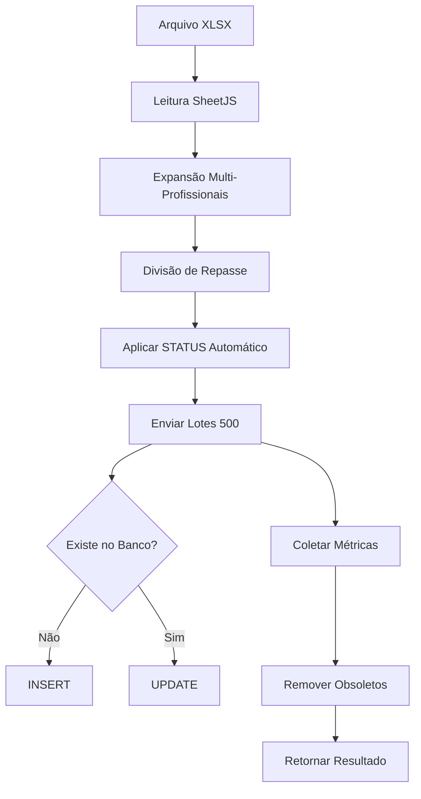

# Comportamento de Upload de XLSX - Atendimentos Existentes

## Visão Geral

Este documento descreve detalhadamente como o sistema se comporta quando um arquivo XLSX contendo atendimentos é enviado, especialmente quando esses atendimentos **já existem** no banco de dados.

## Identificador Único

### Chave Lógica
```
UNIQUE (unidade_code, ATENDIMENTO_ID)
```

Cada atendimento é identificado pela combinação de:
- **`unidade_code`**: Código da unidade (ex: "MB", "ML", "MC")
- **`ATENDIMENTO_ID`**: Identificador único do atendimento dentro da unidade

### Sufixos para Multi-Profissionais

Quando um atendimento tem múltiplos profissionais:

| Tipo | ATENDIMENTO_ID | VALOR | IS_DIVISAO | REPASSE |
|------|----------------|-------|------------|---------|
| Original | `ATE123` | 150.00 | NAO | 75.00 |
| Derivado 1 | `ATE123_1` | 0.00 | SIM | 37.50 |
| Derivado 2 | `ATE123_2` | 0.00 | SIM | 37.50 |

## Operações de Upload

### 1. Inserção (Novo Atendimento)

**Condição**: `ATENDIMENTO_ID` não existe para aquela `unidade_code`

**Ação**: `INSERT` completo com todos os campos

```sql
INSERT INTO processed_data (
    unidade_code, "ATENDIMENTO_ID", "DATA", "HORARIO", "VALOR", 
    "SERVIÇO", "TIPO", "PERÍODO", "MOMENTO", "CLIENTE", 
    "PROFISSIONAL", "ENDEREÇO", "DIA", "REPASSE", whatscliente, 
    "CUPOM", "ORIGEM", "IS_DIVISAO", "CADASTRO", unidade, "STATUS"
) VALUES (...)
```

### 2. Atualização (Atendimento Existente)

**Condição**: `ATENDIMENTO_ID` já existe para aquela `unidade_code`

**Ação**: `UPDATE` via `ON CONFLICT DO UPDATE`

**Campos Atualizados**:
- `DATA` - Data do atendimento
- `HORARIO` - Horário
- `VALOR` - Valor cobrado
- `SERVIÇO` - Tipo de serviço
- `TIPO` - Categoria
- `PERÍODO` - Período do dia
- `MOMENTO` - Manhã/Tarde/Noite
- `CLIENTE` - Nome do cliente
- `PROFISSIONAL` - Nome do profissional
- `ENDEREÇO` - Local do atendimento
- `DIA` - Dia da semana
- `REPASSE` - Valor de repasse
- `whatscliente` - WhatsApp do cliente
- `CUPOM` - Código de cupom
- `ORIGEM` - Origem do cadastro
- `IS_DIVISAO` - Se é registro derivado
- `CADASTRO` - Data de cadastro
- `unidade` - Nome da unidade
- `STATUS` - Status operacional

**Campos Preservados** (nunca alterados):
- `id` - Primary key do registro
- `created_at` - Timestamp de criação original

**Benefício**: Idempotência - fazer re-upload do mesmo arquivo não duplica registros.

### 3. Remoção de Obsoletos

**Função**: `removeObsoleteRecords()`

**Condição**: Registro existe no banco mas não está no arquivo enviado

**Escopo**: Limitado ao período do arquivo (min/max DATA) + unidade específica

**Lógica**:
```typescript
// Extrai ATENDIMENTO_ID base (sem sufixos _1, _2, etc.)
const baseIds = records
  .filter(r => r.IS_DIVISAO === 'NAO')
  .map(r => r.ATENDIMENTO_ID);

// Remove registros cujo ID base não está mais presente
DELETE FROM processed_data
WHERE unidade_code = ?
  AND "DATA" BETWEEN minDate AND maxDate
  AND REPLACE(REGEXP_REPLACE("ATENDIMENTO_ID", '_\\d+$', ''), '_', '') NOT IN (baseIds)
```

**Exemplo**: 
- Arquivo contém apenas `ATE123` (novo mês)
- Banco tinha `ATE100`, `ATE101`, `ATE102` (mês anterior)
- Resultado: Registros antigos são removidos apenas se estiverem no período do novo arquivo

## Lógica de Negócio Adicional

### STATUS Automático

**Função**: `applyWaitStatusForAfternoonShifts()`

**Regra**: Quando uma profissional tem **múltiplos atendimentos no mesmo dia**, os atendimentos com `MOMENTO` contendo "tarde" recebem `STATUS="esperar"`.

**Objetivo**: Sinalizar operacionalmente que há necessidade de coordenação entre turnos.

**Exemplo**:
```typescript
// Registros de Ana Silva em 2025-11-04
[
  { PROFISSIONAL: "Ana Silva", DATA: "2025-11-04", MOMENTO: "Manhã" },   // STATUS padrão
  { PROFISSIONAL: "Ana Silva", DATA: "2025-11-04", MOMENTO: "Tarde" },   // STATUS="esperar"
  { PROFISSIONAL: "Ana Silva", DATA: "2025-11-04", MOMENTO: "Noite" }    // STATUS padrão
]
```

## Função RPC

### Assinatura
```sql
process_xlsx_upload(
  unit_code_arg text,
  records_arg jsonb
)
RETURNS jsonb
```

### Retorno
```json
{
  "total": 150,
  "inserted": 45,
  "updated": 100,
  "ignored": 5
}
```

### Definição SQL
```sql
CREATE OR REPLACE FUNCTION process_xlsx_upload(
  unit_code_arg text,
  records_arg jsonb
) RETURNS jsonb AS $$
DECLARE
  rec jsonb;
  inserted_count int := 0;
  updated_count int := 0;
  ignored_count int := 0;
  atendimento_id_val text;
BEGIN
  FOR rec IN SELECT * FROM jsonb_array_elements(records_arg)
  LOOP
    atendimento_id_val := rec->>'ATENDIMENTO_ID';
    
    IF atendimento_id_val IS NULL OR atendimento_id_val = '' THEN
      ignored_count := ignored_count + 1;
      CONTINUE;
    END IF;

    INSERT INTO public.processed_data (
      unidade_code, "ATENDIMENTO_ID", "DATA", "HORARIO", "VALOR", 
      "SERVIÇO", "TIPO", "PERÍODO", "MOMENTO", "CLIENTE", 
      "PROFISSIONAL", "ENDEREÇO", "DIA", "REPASSE", whatscliente, 
      "CUPOM", "ORIGEM", "IS_DIVISAO", "CADASTRO", unidade, "STATUS"
    ) VALUES (
      unit_code_arg, atendimento_id_val, (rec->>'DATA')::date, 
      rec->>'HORARIO', (rec->>'VALOR')::numeric, rec->>'SERVIÇO', 
      rec->>'TIPO', rec->>'PERÍODO', rec->>'MOMENTO', rec->>'CLIENTE', 
      rec->>'profissional', rec->>'ENDEREÇO', rec->>'DIA', 
      (rec->>'REPASSE')::numeric, rec->>'whatscliente', rec->>'CUPOM', 
      rec->>'ORIGEM', rec->>'IS_DIVISAO', (rec->>'CADASTRO')::date, 
      rec->>'unidade', rec->>'STATUS'
    )
    ON CONFLICT (unidade_code, "ATENDIMENTO_ID") DO UPDATE SET
      "DATA" = EXCLUDED."DATA",
      "HORARIO" = EXCLUDED."HORARIO",
      "VALOR" = EXCLUDED."VALOR",
      "SERVIÇO" = EXCLUDED."SERVIÇO",
      "TIPO" = EXCLUDED."TIPO",
      "PERÍODO" = EXCLUDED."PERÍODO",
      "MOMENTO" = EXCLUDED."MOMENTO",
      "CLIENTE" = EXCLUDED."CLIENTE",
      "PROFISSIONAL" = EXCLUDED."PROFISSIONAL",
      "ENDEREÇO" = EXCLUDED."ENDEREÇO",
      "DIA" = EXCLUDED."DIA",
      "REPASSE" = EXCLUDED."REPASSE",
      whatscliente = EXCLUDED.whatscliente,
      "CUPOM" = EXCLUDED."CUPOM",
      "ORIGEM" = EXCLUDED."ORIGEM",
      "IS_DIVISAO" = EXCLUDED."IS_DIVISAO",
      "CADASTRO" = EXCLUDED."CADASTRO",
      unidade = EXCLUDED.unidade,
      "STATUS" = EXCLUDED."STATUS"
    RETURNING (xmax = 0) INTO STRICT inserted;
    
    IF inserted THEN
      inserted_count := inserted_count + 1;
    ELSE
      updated_count := updated_count + 1;
    END IF;
  END LOOP;

  RETURN jsonb_build_object(
    'total', inserted_count + updated_count + ignored_count,
    'inserted', inserted_count,
    'updated', updated_count,
    'ignored', ignored_count
  );
END;
$$ LANGUAGE plpgsql SECURITY DEFINER;
```

## Fluxo Completo de Upload



## Casos de Uso

### Caso 1: Upload Inicial (Primeira Vez)
```
Arquivo: 100 atendimentos
Banco: vazio

Resultado:
- inserted: 100
- updated: 0
- deleted: 0
```

### Caso 2: Re-upload do Mesmo Arquivo
```
Arquivo: 100 atendimentos (mesmos IDs)
Banco: 100 atendimentos existentes

Resultado:
- inserted: 0
- updated: 100
- deleted: 0
```

### Caso 3: Upload com Alterações
```
Arquivo: 100 atendimentos (80 existentes + 20 novos)
Banco: 100 atendimentos antigos

Resultado:
- inserted: 20
- updated: 80
- deleted: 20 (IDs que não vieram no arquivo, dentro do período)
```

### Caso 4: Upload de Novo Mês
```
Arquivo: 100 atendimentos de Dezembro
Banco: 120 atendimentos de Novembro

Resultado:
- inserted: 100
- updated: 0
- deleted: 0 (Novembro preservado, fora do período)
```

## Integração com Pós-Vendas

### Trigger: sync_processed_data_to_pos_vendas

**Comportamento**: Cria registros em `pos_vendas` apenas para **registros originais** (sem sufixo).

**Filtro**: Ignora `ATENDIMENTO_ID` com padrão `_\d+$` (ex: `ATE123_1`, `ATE123_2`)

```sql
CREATE TRIGGER auto_create_pos_vendas_from_processed
AFTER INSERT ON processed_data
FOR EACH ROW
WHEN (
  NEW."ATENDIMENTO_ID" IS NOT NULL 
  AND NEW."ATENDIMENTO_ID" !~ '_\d+$'  -- Ignora derivados
)
EXECUTE FUNCTION sync_processed_data_to_pos_vendas();
```

## Migração Histórica

### De: `orcamento` → Para: `ATENDIMENTO_ID`

**Data**: 2025-11-04

**Motivo**: Coluna `orcamento` removida da tabela, `ATENDIMENTO_ID` já era usado logicamente

**Script**: `docs/sql/2025-11-04_migrate_orcamento_to_atendimento_id.sql`

**Impacto**: 256 registros migrados com sufixos adicionados aos derivados

## Referências

- **Serviço**: `services/ingestion/upload.service.ts`
- **RPC**: `process_xlsx_upload` (Supabase)
- **Constraint**: `processed_data_unidade_atendimento_key`
- **Trigger**: `auto_create_pos_vendas_from_processed`
- **Documentação**: `docs/sql/2025-11-04_migrate_orcamento_to_atendimento_id.sql`
